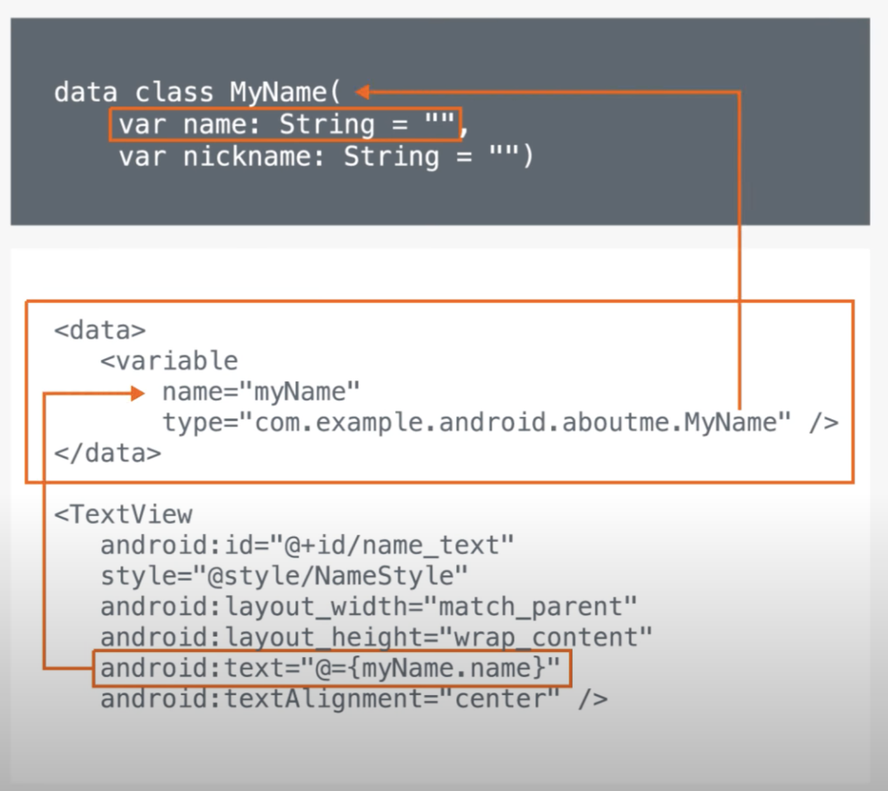

## Udacity Android Ch.2
### 데이터바인딩


```kotlin
private val myName: MyName = MyName("Aleks Haecky")
binding.myName = myName
```

binding.myName에 MyName클래스로 생성핸객체를 연결함

그럼 myName에 데이터가 바인딩되고 kotlin파일에서 컨트롤이 가능

### 구글 인터뷰

MotionLayout으로 애니메이션을 구현하기 쉽다. XML로도 가능하다는데 알아봐야할듯??

ConstraintLayout은 UI룰 뻐르게 개발하기 위해 만듬

개체와 위치를 구현할때는 하이브리드 모델, linear solver가 있음

### Constraint

UI element들을 앵커로 정렬 또는 연결하는것.
부모 레이아웃이나 보이지않는 가이드라인을 활용한다.

#### Constraint Layout의 이점
- 반응형 화면과 결과물을 만들수있음
- 평평한 뷰 계층을 만들수있음
- 레이아웃 뷰 최적화(optimize)
- Free-Form - 자유로운형식, 뷰 어디든 놓을수 있고 에디터가 constraint layout 구현을 도와줌

#### 참고
- [ConstraintLayout으로 반응형 UI 구축](https://developer.android.com/training/constraint-layout/)
- [ConstraintLayout](https://developer.android.com/reference/android/support/constraint/ConstraintLayout)
- [Layout Editor로 UI 빌드](https://developer.android.com/studio/write/layout-editor)
- [ConstraintLayout의 성능 이점 이해](https://android-developers.googleblog.com/2017/08/understanding-performance-benefits-of.html)

### Ratio

width, height를 ratio를 통해 결정

---
