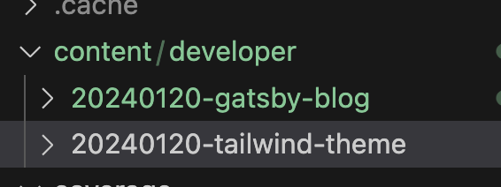

React기반의 블로그인 gatsby를 활용해 블로그를 구축하려고 한다.
v5에서는 타입스크립트도 지원하기에 더욱 편리해졌다.

설치는 문서를 참고하는게 좋다.

이 글에서는 플러그인들을 실제로 어떻게 사용하며, 블로그를 구축하는지 작성하려고 한다.
(나중에는 로컬환경 CMS까지 구축해 쉽게 블로그글을 작성할수 있도록 하고싶다.)


# 몇가지 플러그인 소개


## gatsby-source-filesystem
> A Gatsby plugin for sourcing data into your Gatsby application from your local filesystem.

gatsby에서 로컬파일을 읽어와서 사용할수 있게 해주는 플러그인이다.
이 플러그인을 사용하면 로컬파일을 읽어와서 graphql로 쿼리를 날릴수 있다.

mdx를 사용하기 때문에 gatsby-plugin-mdx플러그인도 함께 설치해주었다.

gatsby-config.js에 아래와 같이 추가해준다.

```js
{
  resolve: 'gatsby-source-filesystem',
  options: {
    "name": "content",
    "path": `${__dirname}/content`
  },
  __key: "content"
}
```

이제 mdx파일들을 인식하는것을 볼수있다.




## gatsby-plugin-mdx


